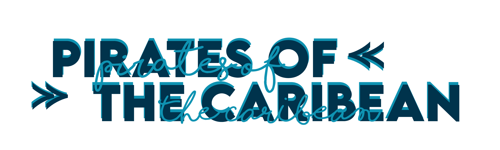

# Marathon-2021

 

## Hello, we are Pirates of the Caribbean!
  
We are making a product about the wetlands in Burgas and the area.  
You can see our presentation here:
<a href="presentation and documentation/Presentation.pptx" >Presentation</a>

 

#  Participants

 

•Alexander Hristov - Scrum Trainer <a href="mailto:aihristov18@codingburgas.bg">Send email</a>  
•Martin Atanasov - Developer Back-end <a href="mailto:mvatanasov18@codingburgas.bg">Send email</a>  
•Petya Petkova - Developer Back-end  <a href="mailto:PIPetkova19@codingburgas.bg">Send email</a>  
•Polya Dimitrova - Developer Front-end <a href="mailto:pddimitrova19@codingburgas.bg">Send email</a>  
•David Donchev - Designer <a href="mailto:dndonchev20@codingburgas.bg">Send email</a>  
•Ivaylo Stoyanov - Designer <a href="mailto:ipstoyanov20@codingburgas.bg">Send email</a>   

 

#  Used technologies

 

 Visual Studio Code  
 Visual Studio   
Teams  
PowerPoint   
Word  
Phonto  

 

#  Future ideas

 

1. To improve the logo.  

 

#  Here is how to download our repo:

 

 - Open cmd with Windows + "R";  
 - Type the directory where you want to download the repo;  
 - Type git clone + https://github.com/mvatanasov18/Marathon-2021.git;  
 
Or you can download it from the site.