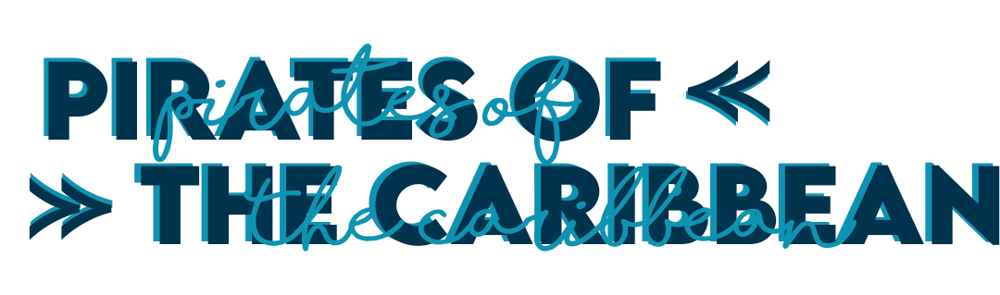

# Marathon-2021




 ---

# Hello, we are Pirates of the Caribbean!
 <br>
We are making a product about the wetlands in Burgas and the area. <br>
You can see our presentation here:
<a href="presentation and documentation/Presentation.pptx" >Presentation</a>

# Table of contents
 
+ [Participants](#participants)
+ [Used technologies](#used-technologies)
+ [Future ideas](#future-ideas)
+ [Installation](#installation)
 

##  Participants <a name = "participants"></a>

 

•Alexander Hristov - Scrum Trainer <a href="mailto:aihristov18@codingburgas.bg">Send email</a> <br>
•Martin Atanasov - Developer Back-end <a href="mailto:mvatanasov18@codingburgas.bg">Send email</a> <br>
•Petya Petkova - Developer Back-end  <a href="mailto:PIPetkova19@codingburgas.bg">Send email</a> <br>
•Polya Dimitrova - Developer Front-end <a href="mailto:pddimitrova19@codingburgas.bg">Send email</a> <br>
•David Donchev - Designer <a href="mailto:dndonchev20@codingburgas.bg">Send email</a> <br>
•Ivaylo Stoyanov - Designer <a href="mailto:ipstoyanov20@codingburgas.bg">Send email</a> <br> 

 

##  Used technologies <a name = "used-technologies"></a>

 

 Visual Studio Code <br>
 Visual Studio  <br>
 Teams <br>
 PowerPoint <br> 
 Word <br>
 Phonto <br>

 

##  Future ideas <a name = "future-ideas"></a>

 

1. To improve the logo. <br>

 

##  Installation
<a name = "installation"></a>

You can download our project from [github](https://github.com/DHGrudov19/CyberFlame.git) by pressing the green clone button.

OR

Paste this line of code in cmd:
````
git clone https://github.com/DHGrudov19/CyberFlame.git
````

## If you support our project, you can always share it on social media. Pull requests are welcome!